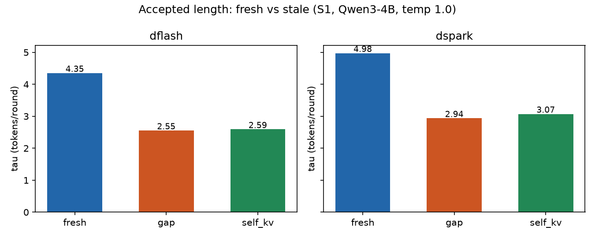

# Speculative Decoding Benchmark

How much does **stale target-hidden-state conditioning** — the situation an
SSD-style ([Speculative Speculative Decoding](https://arxiv.org/abs/2603.03251))
overlap system puts its draft model in — degrade the accepted length of
**DFlash** and **DSpark** block drafts?

Measured on [DeepSpec](https://github.com/sgl-project/DeepSpec) released
checkpoints, target `Qwen/Qwen3-4B`, chain drafting, rejection sampling,
temperature 1.0, 96 prompts (GSM8K / HumanEval / MT-Bench x 32), 256 new
tokens, bf16, 1x A10 on Modal. Total compute cost of everything in this repo:
**$0.78**.

## The three arms

Same prompts, same per-sample seeds; the only difference is *when* the
target's hidden states (the "context features" both drafts condition on)
reach the draft:

| arm | meaning |
|---|---|
| `fresh` | control — stock DeepSpec behavior: features of newly committed tokens are appended to the draft context immediately after each verify |
| `gap` | pessimistic stale (T1) — features arrive **one round late**; while drafting round *r+1* the tokens committed in round *r* have **no rows at all** in the draft context (a moving hole of ~τ tokens) |
| `self_kv` | optimistic/leaky stale (T2) — the hole is filled with the draft's **own proposal K/V rows** for exactly one round, then surgically replaced by the late fresh features |

A real SSD hit-path sits between T1 and T2. Empirically the two arms nearly
coincide, so the bracket is tight.

## Result



| algo | fresh τ | gap τ | self_kv τ | stale/fresh | Δτ (fresh−gap, 95% CI) |
|---|---|---|---|---|---|
| DFlash | 4.35 | 2.55 | 2.59 | **0.59** | +2.04 [+1.89, +2.20] |
| DSpark | 4.98 | 2.94 | 3.07 | **0.59–0.62** | +2.21 [+2.07, +2.36] |

Per domain (τ_stale/τ_fresh): math 57–60%, code 54–58%, chat 61–66% — the
strongest domains lose the most.

See **[Theoretical SSD gain with these numbers](#theoretical-ssd-gain-with-these-numbers)**
below — with these τ ratios (0.586–0.616) the best-case SSD hit path computes
to **0.71–0.77×** of synchronous SD, i.e. a slowdown, versus the ~1.3–1.6×
the SSD paper reports for its standalone-draft configurations.

Implications:

1. To make SSD work with feature-conditioned block drafts, **retrain the
   draft with lagged features** (the DeepSpec training pipeline can produce
   exactly this) or use a standalone draft — the configuration the SSD paper
   reports end-to-end numbers for.
2. `self_kv` buys almost nothing over `gap` (+0.04 / +0.13 τ): the draft's
   own mask-conditioned K/V is a poor substitute for target features.
3. Degradation grows monotonically with hole size (`figs/tau_vs_staleness.png`),
   ~2.7 τ at 1 missing row down to ~1.x at 4+.

More figures: `figs/alpha_k.png` (per-position acceptance),
`figs/pmf.png` (committed-length distribution — the fan-out planning input),
`figs/rank_cdf.png` (correction-token top-F coverage — the p_hit driver).

## Theoretical SSD gain with these numbers

**Model.** Per round, synchronous SD commits τ_fresh tokens in t_verify+t_draft.
An SSD hit commits τ_stale tokens in t_verify (drafting hidden behind
verification); a miss falls back to a JIT draft (τ_fresh, full latency).
The general break-even (p_hit = 1) is

```
R_ssd > R_sync  ⟺  τ_stale/τ_fresh > (max(t_verify, t_primary) + t_comm) / (t_verify + t_draft)
```

which reduces to the best-case threshold `t_verify/(t_verify+t_draft)` only
under three SSD-favorable assumptions: all async draft-side work hides inside
verification (t_primary ≤ t_verify), zero un-overlapped communication/glue
cost, and perfect pre-speculation (p_hit = 1). This matches the SSD paper's
Theorem 7 / Corollary 9; its Corollary 8 ("same-model SSD is never slower")
assumes E_hit = E_SD — precisely the assumption stale conditioning breaks.

**Plugging in S1 measurements** (A10, bf16, bsz=1, p50 timings):

| | τ_fresh | τ_stale | t_draft | t_verify | R_sync | R_ssd (p_hit=1) | ratio |
|---|---|---|---|---|---|---|---|
| DFlash | 4.35 | 2.55–2.59 | 7.2 ms | 36.3 ms | 100 tok/s | 71 tok/s | **0.71×** |
| DSpark | 4.98 | 2.94–3.07 | 9.1 ms | 36.6 ms | 109 tok/s | 84 tok/s | **0.77×** |

Best-case threshold here is 0.80–0.83; measured τ_stale/τ_fresh is
**0.586–0.616**. Because the ratio is below threshold, R_ssd(p) is
*monotonically decreasing in p_hit* — every cache hit trades 7–9 ms of
drafting for ~1.8–1.9 tokens of acceptance — so the optimal operating point
degenerates to p = 0, i.e. plain synchronous SD.

**Why the SSD paper wins where this loses.** Its reported configurations
(Llama-3.1-70B + Llama-3.2-1B; Qwen3-32B + Qwen3-0.6B; Appendix B.2–B.3,
≈1.5–1.6× over its own sync SD, ~+30% over the strongest baselines) have the
two factors reversed: a 7-step autoregressive standalone draft makes t_draft
~40–50% of the cycle (hideable bonus ≈ 1.7–2×), and a standalone draft keeps
τ_stale ≈ τ_fresh. Block drafts draft in one forward, so only ~17–20% of the
cycle is hideable — and feature conditioning then pays −41% acceptance for it.

**SGLang overlap scheduling does not change this.** It overlaps *CPU*
scheduling with GPU compute; draft and verify GPU work still serialize, so it
is orthogonal to (and stackable with) SSD. On an optimized stack the
t_draft/t_verify ratio approaches the draft/target memory-traffic ratio
(≈1.32B/4.0B = 0.33 at 4B; ≈3.42B/14.8B = 0.23 at 14B), putting the
break-even at 0.75–0.81 — still far above 0.586–0.616. Hardware-normalized it
is worse: SSD needs an extra draft GPU (the paper's 4+1 H100 buys ~+30% for
+25% hardware; here 1+1 would buy −23~−29% for +100%).

**What this proxy does and does not show** (all biases run in SSD's favor
except the last): p_hit = 1 assumed; glue/extend/communication ignored;
bsz = 1; and S1's every-round-stale chain τ is a *proxy* for the true
conditional E[τ | cache hit] of an integrated SSD system — the honest
conclusion is that this proxy predicts stale-conditioned DFlash/DSpark SSD
cannot beat synchronous SD on single-request decode throughput, not that any
integrated system has been measured.

**Relation to the SSD paper (corrected after review).** SSD's Appendix E
already identifies this exact mechanism for EAGLE drafts — target activations
arrive one round late, so pre-speculation must self-condition on draft
activations, with acceptance expected to degrade over the trailing K tokens
(Fig. 9) — and the released engine implements it (`draft_runner.py`, draft
activations as surrogate on the hit path, fresh recovery activations on
miss). What the paper does *not* report is any quantitative SSD-EAGLE result
(Appendix B.3 covers standalone drafts only; §6 calls the joint space
"largely unexplored"). This repo's contribution is quantifying one-round-late
conditioning for **KV-injection block drafts** (DFlash/DSpark inject target
features into every layer's K/V — a different representation from EAGLE's
activation input), where neither the SSD nor the DFlash/DSpark papers publish
numbers.

## Correctness gates (why you can trust the numbers)

1. CPU smoke test with tiny random models: 18 combos, all three arms produce
   **token-identical output to target-only greedy** at temperature 0
   (rejection sampling stays exact under any conditioning).
2. S0 on GPU (fp32): 6/6 runs token-identical to target-only greedy with the
   real 4B checkpoints. (In bf16 strict equality fails for a benign reason:
   batched-verify vs serial-greedy reduction order flips near-tie argmaxes.)
3. Every run pins HF revisions, runs offline on GPU, and logs
   seeds/manifest hash/versions in its summary (see `results/*/*.summary.json`).
4. Reviewed by an independent model (Codex, max reasoning) before any GPU
   spend; its P0/P1 findings (budget pre-charge accounting, artifact
   isolation, CUDA fail-fast, revision pinning) are incorporated.

## Reproduce

This code imports the `deepspec` package; clone it *inside* a DeepSpec
checkout:

```bash
git clone https://github.com/sgl-project/DeepSpec
cd DeepSpec && pip install -r requirements.txt
git clone https://github.com/Future-Outlier/speculative-decoding-benchmark ssd_stale_exp

python ssd_stale_exp/smoke_test.py                       # CPU gate
modal run ssd_stale_exp/modal_app.py --action download   # pin + cache models
modal run ssd_stale_exp/modal_app.py --action s0         # fp32 correctness
modal run ssd_stale_exp/modal_app.py --action s1         # the measurement
python ssd_stale_exp/plots.py --results <s1 dir> --out figs
```

Budget guard: cumulative cost is pre-charged per run into the results
volume's `costlog.json`; stages refuse to start work past
`STALE_BUDGET_USD` (default $8).

## Caveats

1. Zero-shot staleness: the drafts were trained with fresh features; a
   stale-trained draft is the obvious next experiment, not covered here.
2. bsz=1, HuggingFace SDPA stack; t_draft/t_verify ratios differ on
   optimized serving stacks and larger targets — recompute the break-even
   with your own timings.
3. At temperature 1.0 the fresh/stale arms follow different trajectories
   after the first divergence; per-round analytic acceptance
   (`E[L] = 1 + Σ Π min(1, p/q)`) matches the sampled τ to <0.02, so
   sampling noise is not driving the gap.
4. MT-Bench uses first turns only (DeepSpec eval convention).

## References

- DSpark: [arXiv:2607.05147](https://arxiv.org/abs/2607.05147) ·
  DFlash: [arXiv:2602.06036](https://arxiv.org/abs/2602.06036) ·
  EAGLE-3: [arXiv:2503.01840](https://arxiv.org/abs/2503.01840) ·
  SSD: [arXiv:2603.03251](https://arxiv.org/abs/2603.03251)
- Code baseline: [sgl-project/DeepSpec](https://github.com/sgl-project/DeepSpec) (MIT)
- Checkpoints: `deepseek-ai/{dflash,dspark}_qwen3_4b_block7`, pinned
  revisions in `results/*/stage_report.json`
